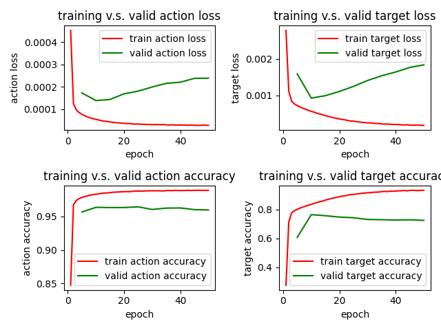
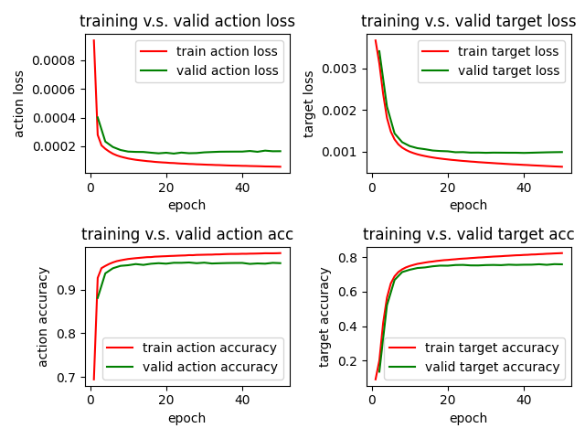
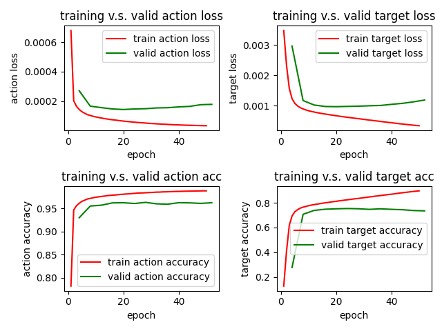
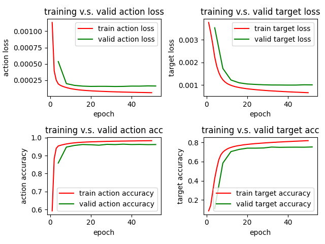
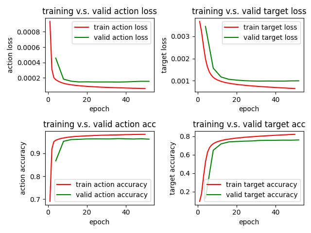

# Model Report

Furong(Flora) Jia | CSCI 499 Coding Assignment 1

## Implementation Detail

### Model architecture

There are three main part of code that I filled up for this assignment: 
(along with their corresponding implementations in `model.py` and `utils.py`)
1. `setup_dataloader` function:  
   For this function, I first read datas from the json file, constructed separate arrays for train
   dataset and valid dataset. After preprocessing with the strings and encoding the input, I created 
   respective datasets, and therefore prepare dataloaders that contain a numpy array of input tokens and a numpy array
   of labels (2D array, one dimension for action, one dimension for target)
2. `setup_model` function:  
   I mainly used the model that I prepared in the `model.py` file.
   This model contains one embedding layer, one LSTM model, and two linear transformations that map 
   the last layer of output from the LSTM model  to actions and targets.
3. `setup_optimizer` function:  
   In this function, I mainly defined my optimizer as the Adam optimizer, as it performs much better than
   SGD due to its self-adaptive way of optimization. I used the cross-entropy to calculate my loss, since
   it's a multi-class classification problem. Also, I didn't include softmax layer in my model because 
   the cross-entropy function in Pytorch already contains the calculation of softmax in itself.

For plotting, I add another function in the `utils.py` to draw plots using matplotlib. 
I mainly compared the performance of the model on training dataset with that on the valid dataset.
This gives me a clear idea of whether there's over-fitting issues, etc.

### Performance of model based on selection of hyperparameters
I rented a server with GPU to train the models, and I have stored the corresponding models in
the `/experiements` folder.  
The following are the parameter combinations that I have tried and their performance accordingly.  
I started with learning rate = 0.001, batch size = 1024, num_epochs (both to speed up my training process)
embedding_dim = 100 (common practice for word embedding, and also because the task is not very complicated),
num_hiddens = 128, num_layers (for LSTM model) = 2 (since it's only a simple classification problem, too large a model may
weaken the performance).  

* num_layers is the number of layers for the LSTM model.

1. lr = 0.001  
   batch_size = 1024  
   num_epochs = 50  
   val_every = 5  
   embedding_dim = 100  
   num_hiddens = 128  
   num_layers = 2  
     
   the model is stored as `/experiments/lstmentire_model_1.pt`.  
   The final test action accuracy is around 0.98, and the final test target accuracy is around 0.92.  
   The final valid action accuracy is around 0.96, and the final valid target accuracy is around 0.76.  
   The validation loss of both target and action begins to increase after around epoch 10,
   but the train loss continues to decrease. Similarly, the validation accuracy of 
   action begins to decrease after around 10 epochs while the train accuracy continues
   to increase. While there is not much difference for the valid action accuracy, the train
   action accuracy growths through epochs. All of this shows that the model is probably
   encountering over-fitting after 10 epochs.  
   Therefore, I will apply two different changes on my parameters respectively. I will
   first try changing it into a 10-epoch model, and see the accuracy. Another choice would
   be to change the learning rate, to see if smaller learning rate can relieve the over-fitting
   problem and keep improving the model.
2. lr = 0.001  
   batch_size = 1024  
   num_epochs = 10  
   val_every = 2  
   embedding_dim = 100  
   num_hiddens = 128  
   num_layers = 2  
     
   The model is stored as `/experiments/lstmentire_model_2.pt`.  
   The final test action accuracy is around 0.98, and the final test target accuracy is around 0.83.  
   The final valid action accuracy is around 0.96, and the final valid target accuracy is around 0.76.  
   This time, all the loss and accuracy begins to behave smoothly, which indicates that
   there is not much improvement in the model. The model still didn't perform as well on the valid
   dataset as on the test dataset. One possible reason is that the there are certain unseen words in
   the valid dataset that weakens the model's performance.  
3. lr = 0.0001 (very small learning rate)  
   batch_size = 1024  
   num_epochs = 50  
   val_every = 2 (a more detailed validation)  
   embedding_dim = 100  
   num_hiddens = 128  
   num_layers = 2  
     
   The model is stored as `/experiments/lstmentire_model_3.pt`.  
   The final test action accuracy is around 0.98, and the final test target accuracy is around 0.82.  
   The final valid action accuracy is around 0.96, and the final valid target accuracy is around 0.76.  
   This time, the model didn't show a decrease in accuracy on the valid dataset. It still begins to 
   behave smoothly after roughly 10 or 20 epochs.
4. lr = 0.0001  
   batch_size = 1024  
   num_epochs = 50  
   val_every = 2  
   embedding_dim = 100  
   num_hiddens = 256  
   num_layers = 3  
   I try to add to the model's complexity to see if this can improve the model's performance.  
     
   The model is stored as `/experiments/lstmentire_model_4.pt`.   
   The final test action accuracy is around 0.98, and the final test target accuracy is around 0.89.  
   The final valid action accuracy is around 0.96, and the final valid target accuracy is around 0.73.  
   This shows that when increase the complexity of the model by adding more layers and more 
   hidden units, the performance didn't go up. Therefore, it is not necessary to use a such complicated
   model for this classification task.
5. Therefore, I tried with the model with one layer to see if simplies the model can imrpove the performance.  
   lr = 0.0001  
   batch_size = 1024  
   num_epochs = 50  
   val_every = 2  
   embedding_dim = 100  
   num_hiddens = 128  
   num_layers = 1  (change to a single layer)  
     
   The model is stored as `/experiments/lstmentire_model_5.pt`.   
   The final test action accuracy is around 0.98, and the final test target accuracy is around 0.81.  
   The final valid action accuracy is around 0.96, and the final valid target accuracy is around 0.75.  
   This time, the model starts from a relatively poor performance compared to the previous ones, but gradually
   converges to a similar performance as the two-layer model. There is not much improvement on the performance.

## Final Model selection and Performance
   ```
   python train.py \
    --in_data_fn=lang_to_sem_data.json \
    --model_output_dir=experiments/lstm \
    --batch_size=1024 \
    --num_epochs=50 \
    --val_every=4
   ```
   embedding_dim = 100  
   num_hiddens = 128  
   num_layers = 2  
     
   The model is stored as `/experiments/lstmentire_model_final.pt`.   
   The final test action accuracy is around 0.98, and the final test target accuracy is around 0.82.  
   The final valid action accuracy is around 0.96, and the final valid target accuracy is around 0.76.  
   You can also execute `final_train.sh` script to train and evaluate the model.
   
