# Model Report

Furong(Flora) Jia | CSCI 499 Coding Assignment 2

## Implementation Detail

### Model architecture

There are three main part of code that I filled up for this assignment: 
(along with their corresponding implementations in `model.py` and `utils.py`)
1. `setup_dataloader` function:  
   For this section, after encoding the sentences (provided), I split the train and test sentences by 70%/30%.
   Then I encode sentences into pairs by only keeping words inside the length (context contain no paddings).   
   Input: array of context_window * 2 length (window size)  
   Output: target token based on the context
2. `setup_model` function:  
   The model is in `model.py`.   
   I implemented the CBOW model for this assignment. 
   It contains one embedding layer of dimension 256, and then sum the embeddings of the context words (`embedding_dim = 256`). 
   After that, I use three fully connected layers to get the prediction of the word:
   ```
   CBOW(
      (embedding): Embedding(3000, 256)
         (fcn): Sequential(
            (0): Linear(in_features=256, out_features=256, bias=True)
            (1): Linear(in_features=256, out_features=512, bias=True)
            (2): Linear(in_features=512, out_features=3000, bias=True)
            )
         )
   ```
3. `setup_optimizer` function:  
   In this function, I mainly defined my optimizer as the Adam optimizer, as it performs much better than 
   SGD due to its self-adaptive way of optimization. I used the cross-entropy to calculate my loss, since
   it's a multi-class classification problem.

For plotting, I add another function in the `utils.py` to draw four plots using matplotlib.

### Performance of model based on selection of hyperparameters

I rented a server with GPU to train the models, and I have stored the `model.ckpt` and `learned_word_vectors.txt` in
the `/output` folder.  

For learning rate, I select `1e-3`, it achieves similar performance as `1e-4` for downstream evaluation.
For embedding dimension, I select `256`, as the model performs relatively better than `embedding_dim=128`
For num_layers of Fully-Connected Layers, I choose to have three layers of fully-connected network so that
it can possibly contain more complicated information. Indeed, the performance is better with a three-layer
fully-connected layer.

I also tried with several batch size since `batch_size=32` runs really slow. I tried `batch_size=32`, `batch_size=128`,
`batch_size=512`. And roughly `batch_size=128` gives the best kind of performance while maintaining a relatively short
training time.   
I have all the executed results in directories names after `output_{batch_size}_{context_window}` contain the output
for these models and `plots_{batch_size}_{context_window}` contain plots for these models

Performance of model differed in batch length and context window length (`num_epoch = 30` for all)

|      batch_size       | context_window | training accuracy | valid accuracy | Overall MR | semantic MR | syntactic MR |
|:---------------------:|:--------------:|:-----------------:|:--------------:|:----------:|:-----------:|:------------:|
|          32           |       2        |       0.214       |     0.213      |     23     |     46      |      9       |
|          128          |       2        |       0.223       |     0.219      |     21     |     39      |      9       |
|          128          |       4        |       0.191       |     0.187      |     18     |     44      |      7       |
| 128 (num_epoch = 100) |       4        |       0.192       |     0.188      |     13     |     30      |      5       |
|          128          |       6        |       0.181       |     0.175      |     28     |     57      |      12      |
|          512          |       2        |       0.229       |     0.222      |     34     |     70      |      14      |
|          512          |       4        |       0.197       |     0.187      |     43     |     94      |      17      |

Note: since the plots for `context_length = 4 batch_size=128` seems not converge on the validation set after 30 epochs. I
also tried to run it for 100 epochs. The validation accuracy and train accuracy didn't improve much (probably because of
the limitation of the data), but the downstream evaluation did improve from  `overall MR = 18` to `overall MR = 14` with both
semantic and syntactic performance enhanced. This probably shows that the current model is not trained to its limit, probably
with a larger dataset and larger vocab size, the performance will be enhanced alongside.

performance after 30 epochs with batch_size = 128 and context_length = 4:

|       |                   Accuracy                   |                      Loss                      |
|:-----:|:--------------------------------------------:|:----------------------------------------------:|
| Train | 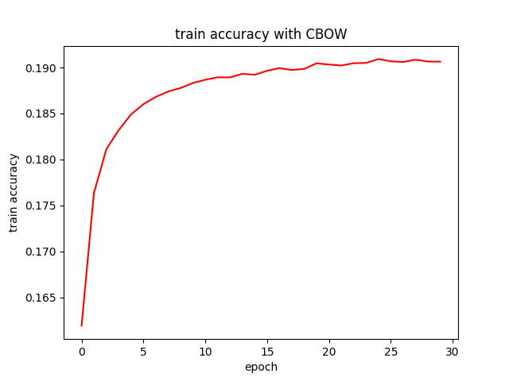 | 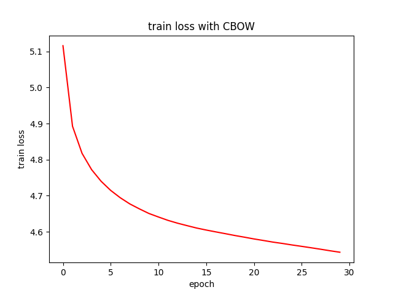 |
|  Val  |   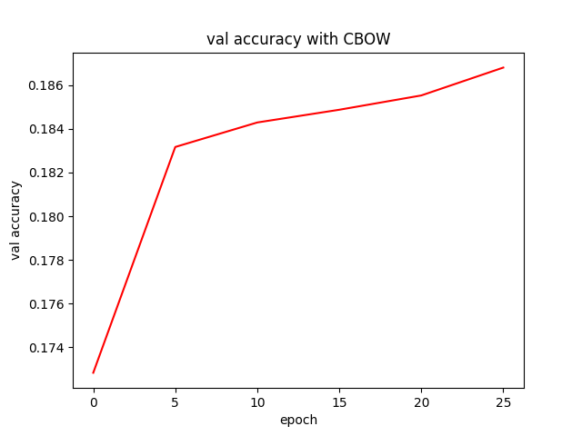   |   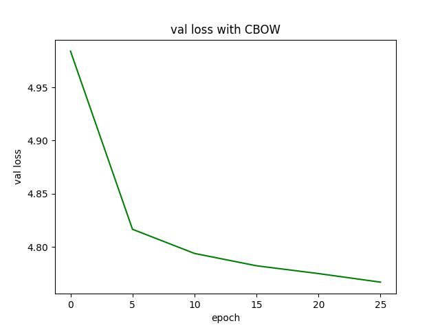   |

This shows that the accuracy on validation set didn't converge to some point so I guess there's still possible improvement
if trained for a longer time.

performance after 100 epochs with batch_size = 128 and context_length = 4:

|       |                       Accuracy                        |                      Loss                      |
|:-----:|:-----------------------------------------------------:|:----------------------------------------------:|
| Train | 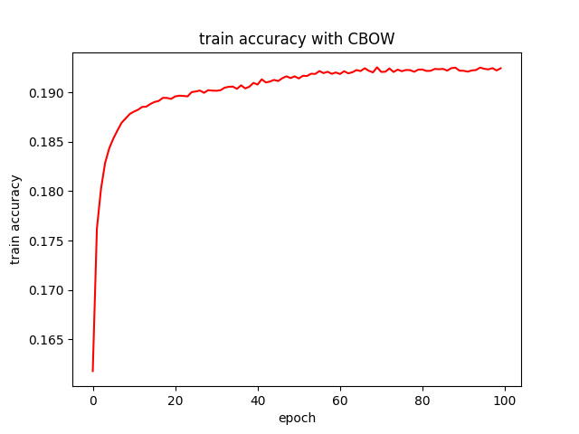 | 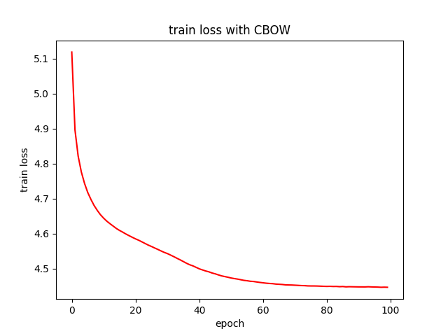 |
|  Val  |       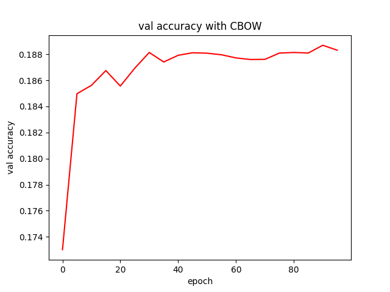        |   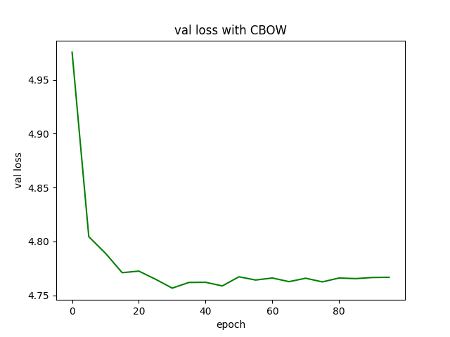   |

The performance finally converges, even though not improving its accuracy on training and validation set. But indeed, downstream
evaluations get better.

## Final Model selection and Performance

```
   python3 train.py \
   --analogies_fn analogies_v3000_1309.json \
   --data_dir books/ \
   --batch_size=128 \
   --context_length=2 \
   --output_dir output_128_2 \
   --plots_dir plots_128_2
```
Overall, the performance is the best with `batch_size = 128` and `context_window = 2`:  
This reaches a train accuracy of 0.223, validation accuracy of 0.219, overal MR of 21, semantic MR of 39, syntactic MR of 9

**Performance in vitro:**

|       |                   Accuracy                   |                      Loss                      |
|:-----:|:--------------------------------------------:|:----------------------------------------------:|
| Train | 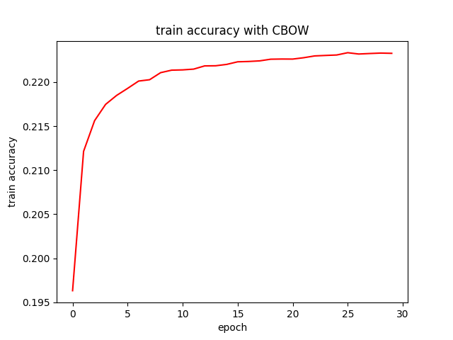 | 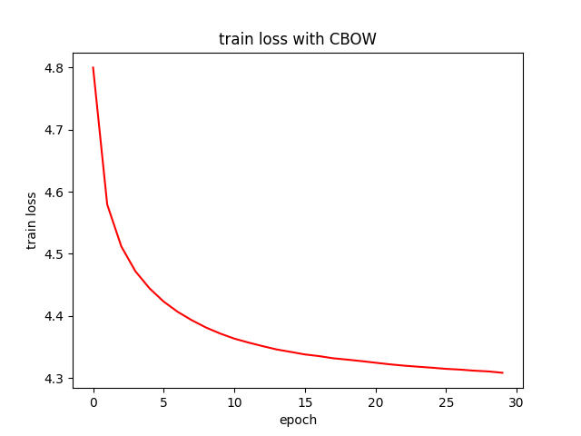 |
|  Val  |   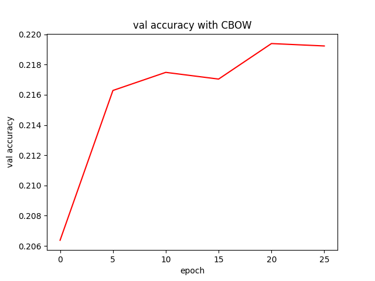   |   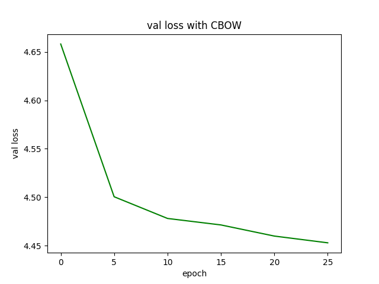   |

**Performance in vivo:**

|           | Exact  |  MRR   | MR  |
|:---------:|:------:|:------:|:---:|
|  Overall  | 0.0275 | 0.0484 | 21  |
| Semantic  | 0.0134 | 0.0256 | 39  |
| Syntactic | 0.0676 | 0.1133 |  9  |

```
...Total performance across all 1309 analogies: 0.0275 (Exact); 0.0484 (MRR); 21 (MR)
...Analogy performance across 969 "sem" relation types: 0.0134 (Exact); 0.0256 (MRR); 39 (MR)
relation        N       exact   MRR     MR
capitals        1       0.0000  0.2500  4
binary_gender   12      0.1667  0.2244  4
antonym 54      0.0556  0.0710  14
member  4       0.0000  0.0138  72
hypernomy       542     0.0111  0.0220  45
similar 117     0.0085  0.0183  55
partof  29      0.0345  0.0397  25
instanceof      9       0.0000  0.0131  76
derivedfrom     133     0.0000  0.0106  94
hascontext      32      0.0000  0.0043  234
relatedto       10      0.0000  0.0050  201
attributeof     11      0.0000  0.0314  32
causes  6       0.0000  0.0245  41
entails 9       0.0000  0.0580  17
...Analogy performance across 340 "syn" relation types: 0.0676 (Exact); 0.1133 (MRR); 9 (MR)
relation        N       exact   MRR     MR
adj_adv 22      0.0000  0.0037  269
comparative     7       0.1429  0.2643  4
superlative     3       0.3333  0.3897  3
present_participle      62      0.0323  0.0770  13
denonym 2       0.0000  0.0122  82
past_tense      64      0.1562  0.2119  5
plural_nouns    107     0.0467  0.0959  10
plural_verbs    73      0.0548  0.0930  11
```

In vitro:  
The validation set and test set accuracy is not very high. But after I increase the number of layers
embedding dimensions, the performance did rise from `16%` to current `22%`.
This possibly indicates that by increase the complexity of model (while not overfitting it), the performance
can possibly rise. Due to the limitation of runtime, I didn't have the chance to implement further comparisons
of other complexity of models.

In vivo:  
The performance of the model for `context_window=2` performs much better on syntactic information
than on semantic information. This is possibly because the limitation of context window mainly allow
it to focus on the local information around a word rather than more distant global semantic information.

## Analysis of Released code 

### Tasks:  
In vitro: 
predict the target word based on the input context. Trained on train dataset and tested on validation dataset.   
In vivo: 
semantic and syntactic relation types of word (bascially whether the word vectors are in the ideal place in the vector space)
semantic relations include capitals, binary_gender, antonym, member, ... 
syntactic relations include ajd_adv, comparative, superlative, ...

### Metrics:
In vitro:  
calculate the cross entropy loss between the probabilities of prediction and the actual token.
In vivo:  
preparing two pairs of word under same relation type: (A, B) and (C, D)  
evaluated on whether the learned word embedding vector follows `A - B = C - D`
Therefore, ideally, for word D, `D = C + B - A`.
calculate `C + B - A` and then store the top 1000 likely word for this calculation
There are three types of values measured here:
1. Exact: calculate whether the top choice (most likely word for `C + B - A`) actually matches with D --> 0 for false 1 for true  
   the score is the percentage of words that get the predicted word exactly correct
2. MRR: measurement for each word is `1/the ranking of the selected word` (reciprocal of ranking)  
   the score is the total score of all words / number of all tested words
3. MR: the score for the whole representation space is the inverse of the MRR score (`MR = 1/MRR`)

### Assumptions and Simplifications
* Currently, we split the dataset to train and validation after `build_tokenizer_table` and sentence encoding. This makes
  the performance on the validation set in vitro analysis less reliable.   
  Meanwhile, in the downstream evaluation (in vivo), we assume that we have the embedding vector for A, B, C, D, so that we
  can do the calculation. If we have a smaller dataset, or a smaller vocab size, or analysis on a wider range of words, our 
  method to predict whether we get the semantic and syntactic relationships between words correctly will be unreliable.
  My guess is that using other tokenization method, such as BPE, can possibly improve our evaluation facing unseen words
  during the downstream task.

* Currently, when converting encoded sentences into pairs of (context, target word), we assume that the target word are surrounded
  by non-padding words. So the first few words in a sentence are not able to become target word. This may affect the ability of getting
  information for words that ofter serve as the beginning of the sentence, such as some nouns, pronouns, etc. Allowing paddings around
  target word or taking two sentences as a group (so we can have some instances of the start of a sentence) during the encoding
  (possibly along with other punctuations) can possibly help models learn this information better.

* In current in vivo evaluation, there's certain imbalance between number of examples for each relation type. For instance, "capitals"
  have only one 1 entry while some other type can have as much as hundreds of entries. The lack of data for evaluation is probably because
  of our small vocab_size (3000). But this also weaken's the evaluation of the model's performance, as many relations are not fully explored.


## Bonus Points Section

I tried with `context_window=4` and `context_window=6` for `batch_size=128`, as mentioned before.
The performance is documented in the previous table. (I copied it to here)


|      batch_size       | context_window | training accuracy | valid accuracy | Overall MR | semantic MR | syntactic MR |
|:---------------------:|:--------------:|:-----------------:|:--------------:|:----------:|:-----------:|:------------:|
|          128          |       2        |       0.223       |     0.219      |     21     |     39      |      9       |
|          128          |       4        |       0.191       |     0.187      |     18     |     44      |      7       |
| 128 (num_epoch = 100) |       4        |       0.192       |     0.188      |     13     |     30      |      5       |
|          128          |       6        |       0.181       |     0.175      |     28     |     57      |      12      |


**context_window=4**

|       |                   Accuracy                   |                      Loss                      |
|:-----:|:--------------------------------------------:|:----------------------------------------------:|
| Train |  |  |
|  Val  |      |      |

**context_window=4 num_epoch=100**

|       |                       Accuracy                        |                      Loss                      |
|:-----:|:-----------------------------------------------------:|:----------------------------------------------:|
| Train |  |  |
|  Val  |               |      |

**context_window=6**

|       |                   Accuracy                   |                      Loss                      |
|:-----:|:--------------------------------------------:|:----------------------------------------------:|
| Train | 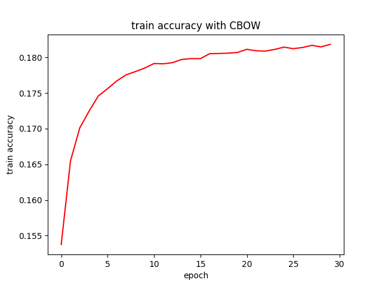 | 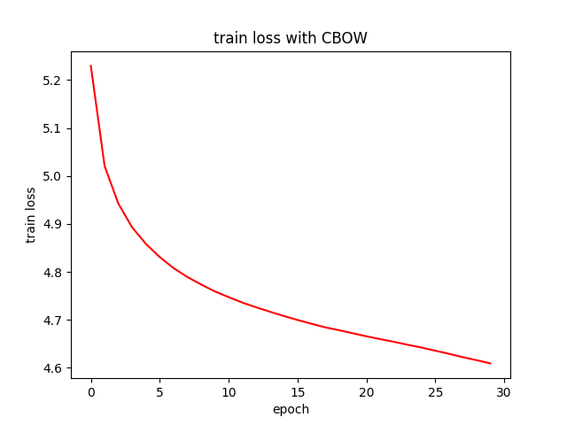 |
|  Val  |   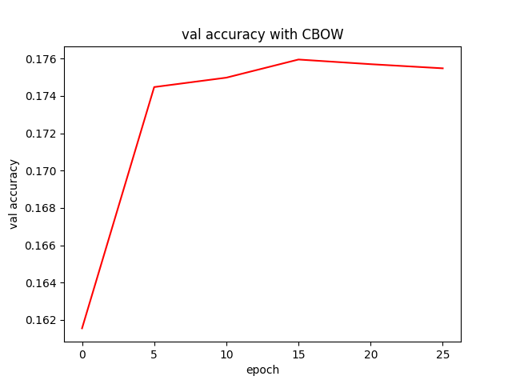   |   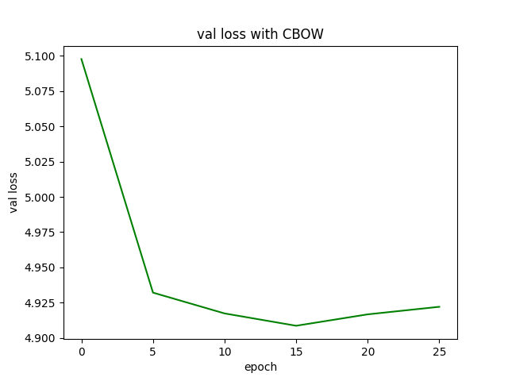   |


In vitro, the train accuracy and val accuracy is comparatively lower than that of context window of length 2.
This may partially because we have a longer window, therefore there is fewer data for the model to learn from. 
Also, longer window size probably contain some irrelevant information that makes the model to even fail on examples
that it was able to pass with a shorted context window.

In vivo, the performance didn't increase much (or even decrease) when I keep them running for 30 epochs. 
Ideally, a longer context length should lead to a better performance of the semantic information, 
but the semantic performance didn't really improve much.
However, when I try running the model with `context_window=4` for 100 epochs, the model reaches  `overall MR = 13, 
semantic MR = 30, syntactic MR = 5` after roughly 45 epochs. 

This is the documented performance at that point:
```
...Total performance across all 1309 analogies: 0.0451 (Exact); 0.0773 (MRR); 13 (MR)
...Analogy performance across 969 "sem" relation types: 0.0175 (Exact); 0.0329 (MRR); 30 (MR)
relation        N       exact   MRR     MR
capitals        1       0.0000  0.5000  2
binary_gender   12      0.1667  0.2432  4
antonym 54      0.0926  0.1017  10
member  4       0.0000  0.0858  12
hypernomy       542     0.0074  0.0233  43
similar 117     0.0171  0.0267  37
partof  29      0.0000  0.0149  67
instanceof      9       0.0000  0.0048  208
derivedfrom     133     0.0075  0.0206  49
hascontext      32      0.0000  0.0022  455
relatedto       10      0.1000  0.1013  10
attributeof     11      0.0909  0.0928  11
causes  6       0.0000  0.0571  18
entails 9       0.1111  0.1326  8
...Analogy performance across 340 "syn" relation types: 0.1235 (Exact); 0.2040 (MRR); 5 (MR)
relation        N       exact   MRR     MR
adj_adv 22      0.0000  0.0110  91
comparative     7       0.4286  0.5123  2
superlative     3       0.3333  0.3446  3
present_participle      62      0.0806  0.1806  6
denonym 2       0.0000  0.2526  4
past_tense      64      0.1562  0.2616  4
plural_nouns    107     0.1308  0.2036  5
plural_verbs    73      0.1233  0.1952  5
```

This probably shows that context window length did help with the model to learn more about the semantic
information, but we need to fully train our model with enough data and training epochs. Meanwhile, with
a larger context length means that we have relatively less input and output pairs for our model from the
same encoded sentences, that's also probably part of the reason why our model can't improve as much when
everything else are kept the same compared to a context window of length 2.

