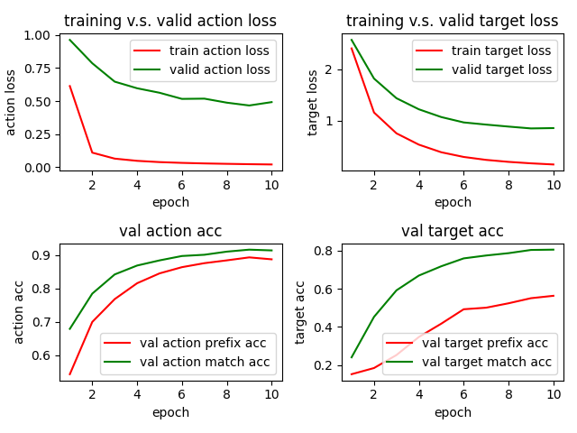
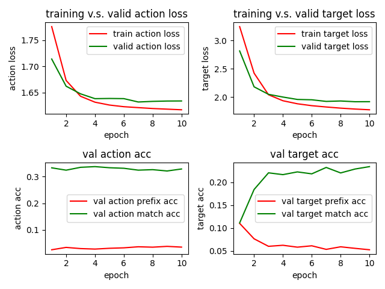
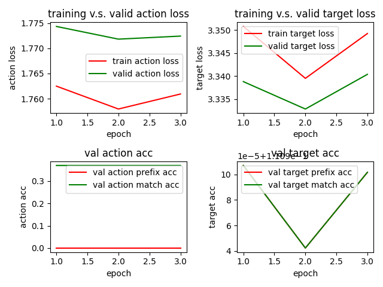

# Model Report

Furong(Flora) Jia | CSCI 499 Coding Assignment 3

## Implementation Detail

### Preprocessing Data
* pack instructions of an episode together to one sequence, add `<start>` token in the front and
  `<end>` token around the long instruction (length of sequence is around 140 or something)
* add additional tokens for output labels: `<start> = 0`, `<pad> = 1`, `<stop>=2`, make the seq_len for
  labels the max_len of labels in one episode, add `<start>` and `<end>` token and pad it with `<pad>`

### Evaluation
implement `prefix_match` and `exact_match`: exact_match is a more generous version of prefix_match
* prefix_match: need all the predictions before it also to be true to be counted
* exact_match: actual number of matches (no need for the previous predictions to be true)

I implemented the exact_match because I got a bunch of zeros for the prefix_match at the start, and
I want to be less strict to my model to see how it predicts in the whole sequence. 
Also, I add a weight tensor for the CrossEntropy trying to make it take more efforts to predict `<start>`,
so it won't get a prefix_match of 0 for getting the `<start>` wrong (can't tell anything in that case)
I take the exact_match as a similar version of the accuracy in hw1 (since it also compares individual
predictions), despite it's actually a sequential output here.

### Model implementation
I choose LSTM for encoder and decoders.

**Encoder**

It first embeds instructions to word embeddings, and then use the LSTM to encoder the long instruction
into encoder_output(which contain all hidden states of the sequence), hidden_state, and cell_state.
I used `pack_padded_sequence` and `pad_packed_sequence` to improvement the performance

**Decoder**

It embeds the action and target labels from the previous results, and then concatenate the two embeddings.
The concatenated representation is then processed by the LSTM decoder to get decoded representations

**EncoderDecoder**

The basic version of encoderDecoder is like a wrapper for the encoder and decoder.
It first gets the output and hidden from the encoder, and then went through a loop containing decoders to
get the decoded representation. 

In the loop, the representation is then interpreted into actions and targets
(logits) by two separate linear model. In training mode, `teacher_forcing` is set to True and the next decoder
will take in the correct label for the next iteration; in validation mode, the model will take its predicted
results into the next iteration of decoder and operate based on that. 

In the end, sequences of predictions are returned from the model as logits over each class.
They are turned into actual predictions by taking `argmax` in `train.py`

**EncoderDecoder with Attention**

If `args.model==attention`, it will compute the softmax score for each encoder hidden state (namely,
for the hidden state of each timestamp) in the `getAttention` function in `EncoderDecoder` class.

It is implemented by first repeating the decoder hidden state to the same length as the encoder_output
(seq_len, batch_size, hidden_dim), and then concat the hidden_dim for the two tensors. (Make the shape
(seq_len, batch_size, 2*hidden_dim)). 

Then it use a fully-connected layer to get the score for each concatenated hidden state, and returns
the softmax version score tensor so they add up to 1.
(map from 2*hidden_dim to 1 -- a single number)

After getting the score for each timestamp in a sequence, it calculated the weighted sum of the hidden
state based on the score (score1 * encoder1 + score2 * encoder2 + ... ). Finally it use this weighted
version of the hidden state in the `EncoderDecoder` to get the predictions for actions and targets.

**BERTEncoder**
For the transformer-based model, I implemented the BERTEncoder (replacing the LSTM Encoder by a pretrained
BERT). The idea is that probably BERT captures information better at a long sequence (it didn't suffer
from forgetness) compared with LSTM stuffs. Also, since the decoder is mapped to index of actions and
targets labels rather than words, probably it makes more sense to only use the BERT for the encoder.

**optimizer**
I choose Adam for optimizer as before and use CrossEntropy for calculating loss which ignores `<pad>`.

Since I want the model to get a high prefix_match, I tried with the weight tensor, an optional parameter
for CrossEntropy, and I put slightly more weight on the 0 index (which accounts for the start token). 
Surviving is the hope for achieving higher prefix_match score. I tried with some crazy weights before, 
and I found that if put too much weights on 0, it will just predict all 0, so I finally settled with 
approximately twice weights on 0 compared with each of other class. (assigned 2 to class 0, and 1 for
all other classes, and finally use softmax to make it the probability distribution)


## Model Performance

I add another argument `--model` to determine which kind of model to work on, `vanilla` is the basic 
EncoderDecoder, `attention` is the EncoderDecoder with attention, `transformer` is the model with
the BERTEncoder

I run the three shell scripts (arguments such as batch size and epoch_num are in the script) for the three models.

The match in the plots stands for `exact_match` and prefix stands for `prefix_match`.

### EncoderDecoder (Vanilla)

```
sh vanilla.sh
```



(see my definition for evaluation above, it's probably not the same **exact match** as expected)

|                   | train | valid |
|:-----------------:|:-----:|:-----:|
|    action loss    | 0.018 | 0.466 |
|    target loss    | 0.154 | 0.852 |
| action prefix acc |  N/A  | 0.893 |
| target prefix acc |  N/A  | 0.563 |
| action exact acc  |  N/A  | 0.916 |
| target exact acc  |  N/A  | 0.805 |


```
train_action_loss_record:  [0.6135697669309118, 0.10855432302839514, 0.06316080567953379, 0.0463782577249019, 0.03679866496257592, 0.03089117377564527, 0.026724078854464966, 0.023625428167482216, 0.020931389682210873, 0.018829209021414103]
train_target_loss_record:  [2.402338401131008, 1.1615217328071594, 0.7579478081585704, 0.5385450820128123, 0.3910613990780236, 0.3003176927998446, 0.2433149706626284, 0.20492495304864386, 0.1766405458683553, 0.15461810300315637]
val_action_loss_record:  [0.96389306584994, 0.7867189347743988, 0.6472078661123911, 0.5969764093557993, 0.5629279017448425, 0.5163423965374628, 0.5182702938715616, 0.4877863625685374, 0.46637454628944397, 0.4919298440217972]
val_target_loss_record:  [2.5670032898585, 1.8188093701998393, 1.4381447831789653, 1.22322416305542, 1.0728067755699158, 0.968931665023168, 0.9267009695370992, 0.8883641064167023, 0.8525758882363638, 0.8593462705612183]
val_action_prefix_acc_record:  [0.5428521434466044, 0.699523905913035, 0.7679523130257925, 0.8155960639317831, 0.8451037506262461, 0.8637702564398447, 0.8757517039775848, 0.8841820359230042, 0.8931032419204712, 0.8872833450635275]
val_target_prefix_acc_record:  [0.15229844550291696, 0.18461361527442932, 0.25269203384717304, 0.3472241808970769, 0.41722117861111957, 0.49274874726931256, 0.5009687642256418, 0.5240416129430135, 0.5507532954216003, 0.5632958014806112]
val_action_exact_acc_record:  [0.6787887911001841, 0.7844488322734833, 0.8419448037942251, 0.8686324854691824, 0.8840665618578593, 0.8972406188646952, 0.9009509483973185, 0.9103070000807444, 0.9162936906019846, 0.9139761726061503]
val_target_exact_acc_record:  [0.24084530770778656, 0.45281365513801575, 0.5918098489443461, 0.669372022151947, 0.7181602716445923, 0.7594515283902487, 0.7745709717273712, 0.7868255178133646, 0.8036741117636362, 0.8052828113238016]
```

It's actually pretty weird to get such a high accuracy and low loss for vanilla EncoderDecoder structure. I tried to
print some predictions (because I suspect my code), and it turns out that the sequence of labels in the dataset itself
is very periodical. It basically requires to `GoToLocation`, do one or two things with the objects like `PutObject` or
`PickUp Object`, and then turns to `GoToLocation` again. It probably accounts for why the vanilla EncoderDecoder can
perform so well (if my code is correct). The prediction from my code is often just a repetitive pattern, especially
for actions.


### Attention

```
sh attention.sh
```




|                   | train | valid |
|:-----------------:|:-----:|:-----:|
|    action loss    | 1.617 | 1.634 |
|    target loss    | 1.778 | 1.921 |
| action prefix acc |  N/A  | 0.038 |
| target prefix acc |  N/A  | 0.110 |
| action exact acc  |  N/A  | 0.337 |
| target exact acc  |  N/A  | 0.234 |


```
train_action_loss_record:  [1.7756985321911898, 1.6732645533301613, 1.6431926965713501, 1.6319449030269275, 1.6265017357739535, 1.623342876000838, 1.6215790323777632, 1.61988046169281, 1.6186879392103715, 1.6174980397657914]
train_target_loss_record:  [3.245605832013217, 2.4249949368563564, 2.043875915787437, 1.938044826334173, 1.8846896886825562, 1.8509037026492032, 1.8279304187948053, 1.8075530381636187, 1.7914958758787676, 1.7788013211163607]
val_action_loss_record:  [1.7140475511550903, 1.6623353064060211, 1.6478159427642822, 1.6386333405971527, 1.6390046775341034, 1.6386942863464355, 1.6322997212409973, 1.633476306994756, 1.63411941130956, 1.6342616379261017]
val_target_loss_record:  [2.816952387491862, 2.1839729944864907, 2.0511165658632913, 2.0033608178297677, 1.9609985649585724, 1.95497061808904, 1.9265189568201702, 1.9338451623916626, 1.920672615369161, 1.921605795621872]
val_action_prefix_acc_record:  [0.025354665704071522, 0.03418310716127356, 0.02974370898058017, 0.027928904940684635, 0.030858326548089583, 0.03257213129351536, 0.036537047320355974, 0.035063551583637796, 0.03807443721840779, 0.03528377894933025]
val_target_prefix_acc_record:  [0.11038270965218544, 0.0766653170188268, 0.06025808583945036, 0.06253134676565726, 0.05840884211162726, 0.061381514805058636, 0.05358971903721491, 0.05919116114576658, 0.05581649982680877, 0.052734813963373504]
val_action_exact_acc_record:  [0.33289720366398495, 0.32412054886420566, 0.3348086203138034, 0.33743761231501895, 0.333263265589873, 0.33122002333402634, 0.3241846164067586, 0.3260330334305763, 0.32105617225170135, 0.3286050409078598]
val_target_exact_acc_record:  [0.11135361902415752, 0.18435223400592804, 0.22076544910669327, 0.21684199199080467, 0.22280225281914076, 0.21855921546618143, 0.23253895342350006, 0.22055767849087715, 0.2290912109116713, 0.23434421916802725]
```

Before the results, my hypothesis is that attention will perform better than the vanilla. But it didn't turn out to be so.
Probably attention require some more learned parameters, and the dataset is small (like only 20k episodes). Or I suspect
that there's some trivial bug I cannot detect, which is quite likely.

**Discuss your encoder-decoder attention choices (e.g., flat or hierarchical, recurrent cell used, etc.)**

The encoder-decoder attention is a flat one, since it concatenates all the instructions together and process all the
information on the word-level. For the recurrent cell used, I choose the LSTM for both encoder and decoder for the
`EncoderDecoder` with attention.

**Discuss the attention mechanism you implemented for the encoder-decoder model using the taxonomy we discussed in class.**

The attention mechanism implemented here is a single-headed global soft attention. Since the score for each hidden state
of the whole sequence is processed by softmax rather than argmax, it is soft. And since all the position in the sequence
is taken into consideration, it is global. Therefore, global soft.

### BERT (replacing encoder)
```
sh transformer.sh
```



*The valid target accuracy is actually very smooth around 0.111 for both prefix match and exact match, the plot is just
trying to represent some minor difference in 1e-5 significance.*


|                   | train | valid |
|:-----------------:|:-----:|:-----:|
|    action loss    | 1.757 | 1.771 |
|    target loss    | 3.339 | 3.332 |
| action prefix acc |  N/A  |   0   |
| target prefix acc |  N/A  | 0.111 |
| action exact acc  |  N/A  | 0.370 |
| target exact acc  |  N/A  | 0.111 |


```
train_action_loss_record:  [1.7624889536776431, 1.7579425003618667, 1.7609271654824425]
train_target_loss_record:  [3.350804866526851, 3.3395039863786105, 3.349262333372044]
val_action_loss_record:  [1.7743541417496929, 1.7718322250280487, 1.7724368090040228]
val_target_loss_record:  [3.3387887290354525, 3.332822700564781, 3.340376181548901]
val_action_prefix_acc_record:  [0.0, 0.0, 0.0]
val_target_prefix_acc_record:  [0.11100699568397543, 0.11094238550475474, 0.11100162465250894]
val_action_exact_acc_record:  [0.3700561828157875, 0.3700325026940764, 0.36997841985038155]
val_target_exact_acc_record:  [0.11100699576768983, 0.11094238550475474, 0.11100162465250894]
```

I used the BERTEncoder which use a pre-trained model to replace the original LSTM encoder. I also make the hidden
dimension equal to 768 to adapt to the pre-trained model. But the performance disappointed me.

The idea is to get a better representation of the whole sequence: my thought is that less forgetness for the
instructions in the earlier time will contribute to a better representation from the encoder. But probably the LSTM
decoder and BERT encoder is not that compatible for their representation of instructions. Like an English NLP researcher
speaking English to a French speaker. In chinese, there's a phrase interpreted like a chicken talking to a duck probably
can describe my understanding for this communication between BERT encoder and LSTM decoder.
And the parameters in a BERT model is way too many to get efficiently trained on a BERT base model, and our dataset is
way too small to finetune the model. Since it takes long, I run it only with three epochs, and the loss and accuracy
barely changes along the training process.


### comparison of performance
Actually, my discuss on model's performance are already presented under each model. My original hypothesis for the
models are BERT > attention > vanilla (BERT and attention should perform better than vanilla).
But the results turn out that vanilla actually outperforms the other two. One explanation would be the dataset is small
and the other two models require more parameters to be learned. Or the attention is actually not helping that much, 
since when the decoder knows the previous pair of labels, the prediction on the next label has the pattern in it. (Eg: 
after PutObject, even though I don't have the instruction, it's very likely that the next action is GoToLocation). And
since vanilla EncoderDecoder gives the context of a instruction, it performs better than the prediction using LSTM in hw1.
(since the dataset sometimes need contexts of instructions to tell what actually the target should be)

Admittedly, another alternative hypothesis is that there's functional bug in my code, but I haven't caught it. That would
be so sad for all my analysis and experiments.
